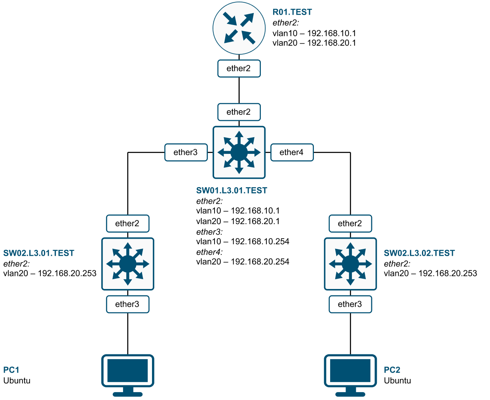
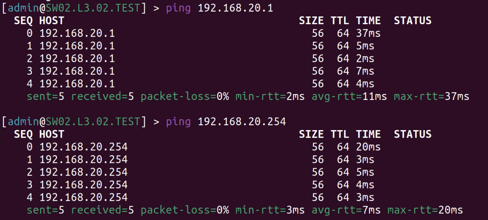
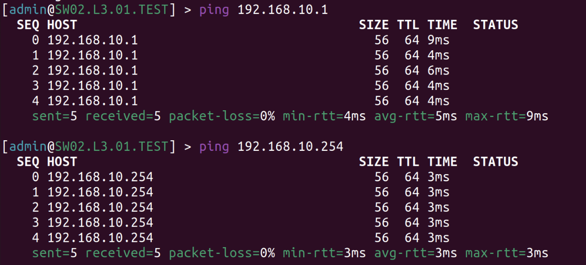
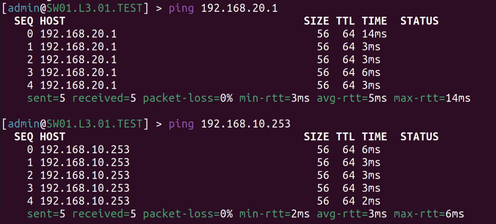
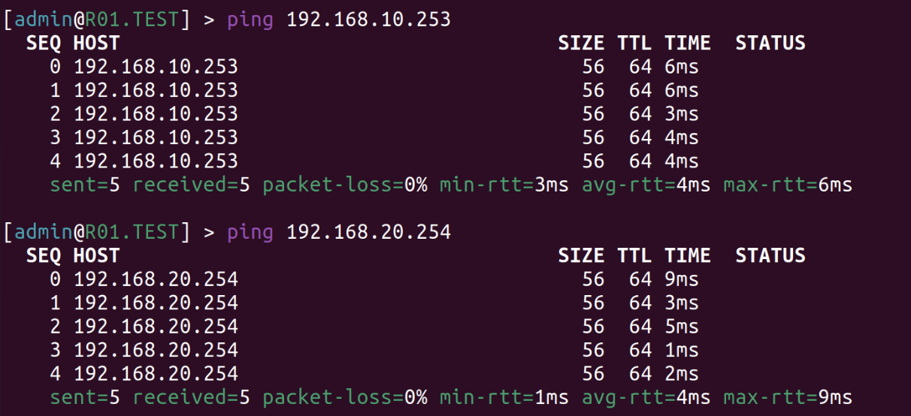

University: [ITMO University](https://itmo.ru/ru/)

Faculty: [FICT](https://fict.itmo.ru)

Course: [Introduction in routing](https://github.com/itmo-ict-faculty/introduction-in-routing)

Year: 2022/2023

Group: K33202

Author: Tanachev Egor Antonovich

Lab: Lab1

Date of create: 25.10.2022

Date of finished: 13.01.2023

# Отчет по лабораторной работе №1 "Установка ContainerLab и развертывание тестовой сети связи"

**Цель работы:** ознакомиться с инструментом ContainerLab и методами работы с ним, изучить работу VLAN, IP адресации и т.д; развернуть тестовую сеть связи, настроить оборудование на базе Linux и RouterOS.

### Ход работы

**1. Текст файла, который был использовался для развертывания тестовой сети с расширением .yaml:**

Для того, чтобы развернуть нашу тестовую сеть мы установили docker, ContainerLab, make и др. После чего мы создали файл *lab1.yaml* и расписали необходимые настройки. Ниже представлен код файла.

```
name: lab1


mgmt:
  network: statics
  ipv4_subnet: 172.20.20.0/24


topology:
  nodes:
    R01.TEST:
      kind: vr-ros
      image: vrnetlab/vr-routeros:6_47_9
      mgmt_ipv4: 172.20.20.2

    SW01.L3.01.TEST:
      kind: vr-ros
      image: vrnetlab/vr-routeros:6_47_9
      mgmt_ipv4: 172.20.20.3
    

    SW02.L3.01.TEST:
      kind: vr-ros
      image: vrnetlab/vr-routeros:6_47_9
      mgmt_ipv4: 172.20.20.4


    SW02.L3.02.TEST:
      kind: vr-ros
      image: vrnetlab/vr-routeros:6_47_9
      mgmt_ipv4: 172.20.20.5

    PC1:
      kind: linux
      image: ubuntu:latest
      mgmt_ipv4: 172.20.20.6

    PC2:
      kind: linux
      image: ubuntu:latest
      mgmt_ipv4: 172.20.20.7


  links: 
    - endpoints: ["R01.TEST:eth1", "SW01.L3.01.TEST:eth1"]
    - endpoints: ["SW01.L3.01.TEST:eth2", "SW02.L3.01.TEST:eth1"]
    - endpoints: ["SW01.L3.01.TEST:eth3", "SW02.L3.02.TEST:eth1"]
    - endpoints: ["SW02.L3.01.TEST:eth2", "PC1:eth1"]
    - endpoints: ["SW02.L3.02.TEST:eth2", "PC2:eth1"]
```

**2. Схема связи:**



**3. Текст конфигураций сетевых устройств:**

**Роутер (R01.TEST)**

```
/interface vlan
add interface=ether2 name=vlan10 vlan-id=10
add interface=ether2 name=vlan20 vlan-id=20
/interface wireless security-profiles
set [ find default=yes ] supplicant-identity=MikroTik
/ip pool
add name=pool10 ranges=192.168.10.10-192.168.10.254
add name=pool20 ranges=192.168.20.10-192.168.20.254
/ip dhcp-server
add address-pool=pool10 disabled=no interface=vlan10 name=dhcp10
add address-pool=pool20 disabled=no interface=vlan20 name=dhcp20
/ip address
add address=172.31.255.30/30 interface=ether1 network=172.31.255.28
add address=192.168.10.1/24 interface=vlan10 network=192.168.10.0
add address=192.168.20.1/24 interface=vlan20 network=192.168.20.0
/ip dhcp-client
add disabled=no interface=ether1
/ip dhcp-server network
add address=192.168.10.0/24 gateway=192.168.10.1
add address=192.168.20.0/24 gateway=192.168.20.1
/system identity
set name=R01.TEST
```

**Свитч 1-ого уровня (SW01.L3.01.TEST)**

```
/interface bridge
add name=bridge10
add name=bridge20
/interface vlan
add interface=ether2 name=vlan10 vlan-id=10
add interface=ether2 name=vlan20 vlan-id=20
add interface=ether3 name=vlan100 vlan-id=10
add interface=ether4 name=vlan200 vlan-id=20
/interface wireless security-profiles
set [ find default=yes ] supplicant-identity=MikroTik
/interface bridge port
add bridge=bridge10 interface=vlan10
add bridge=bridge10 interface=vlan100
add bridge=bridge20 interface=vlan200
add bridge=bridge20 interface=vlan20
/ip address
add address=172.31.255.30/30 interface=ether1 network=172.31.255.28
/ip dhcp-client
add disabled=no interface=ether1
add disabled=no interface=bridge10
add disabled=no interface=bridge20
/system identity
set name=SW01.L3.01.TEST
```

**Свитч 2-ого уровня (SW02.L3.01.TEST)**

```
/interface bridge
add name=bridge10
/interface vlan
add interface=ether2 name=vlan10 vlan-id=10
/interface wireless security-profiles
set [ find default=yes ] supplicant-identity=MikroTik
/interface bridge port
add bridge=bridge10 interface=vlan10
add bridge=bridge10 interface=ether3
/ip address
add address=172.31.255.30/30 interface=ether1 network=172.31.255.28
/ip dhcp-client
add disabled=no interface=ether1
add disabled=no interface=bridge10
/system identity
set name=SW02.L3.01.TEST
```

**Свитч 2-ого уровня (SW02.L3.02.TEST)**

```
/interface bridge
add name=bridge20
/interface vlan
add interface=ether2 name=vlan20 vlan-id=20
/interface wireless security-profiles
set [ find default=yes ] supplicant-identity=MikroTik
/interface bridge port
add bridge=bridge20 interface=vlan20
add bridge=bridge20 interface=ether3
/ip address
add address=172.31.255.30/30 interface=ether1 network=172.31.255.28
/ip dhcp-client
add disabled=no interface=ether1
add disabled=no interface=bridge20
/system identity
set name=SW02.L3.02.TEST
```

**4. Результаты пингов для проверки локальной связности**

**Проверка Роутера**



**Проверка Свитча 1-ого уровня**



**Проверка первого Свитча 2-ого уровня**



**Проверка второго Свитча 2-ого уровня**



### Вывод

В ходе работы были получены практические навыки по работе с инструментами ContainerLab, а так же были изучены VLAN и IP адресация. Результатом стала развернутая тестовая сеть связи и настроенное оборудование.