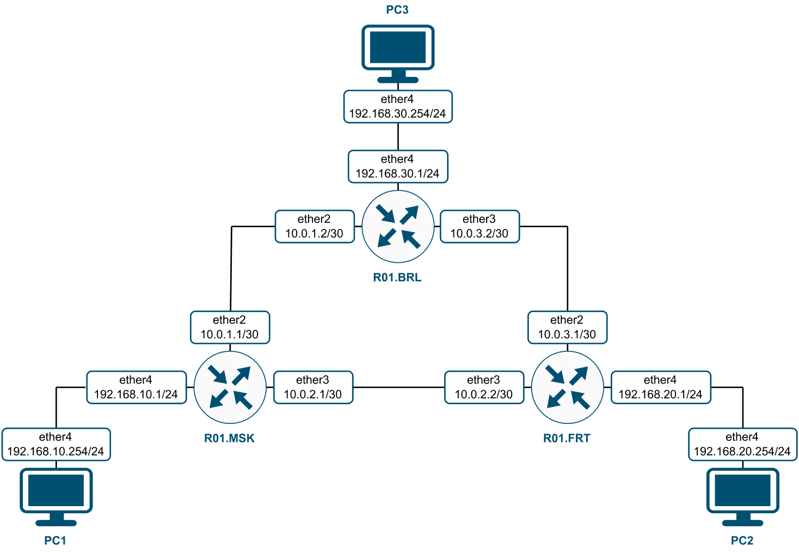

University: [ITMO University](https://itmo.ru/ru/)

Faculty: [FICT](https://fict.itmo.ru)

Course: [Introduction in routing](https://github.com/itmo-ict-faculty/introduction-in-routing)

Year: 2022/2023

Group: K33202

Author: Tanachev Egor Antonovich

Lab: Lab2

Date of create: 01.11.2022

Date of finished: 13.01.2023

# Отчет по лабораторной работе №2 "Установка ContainerLab и развертывание тестовой сети связи"

**Цель работы:** ознакомиться с принципами планирования IP адресов, настройке статической маршрутизации и сетевыми функциями устройств.

### Ход работы

**1. Текст файла, который был использовался для развертывания тестовой сети с расширением .yaml:**

```
name: lab2


mgmt:
  network: statics
  ipv4_subnet: 172.20.20.0/24


topology:
  nodes:
    R01.MSK:
      kind: vr-ros
      image: vrnetlab/vr-routeros:6_47_9
      mgmt_ipv4: 172.20.20.2

    R01.BRL:
      kind: vr-ros
      image: vrnetlab/vr-routeros:6_47_9
      mgmt_ipv4: 172.20.20.3
    
    R01.FRT:
      kind: vr-ros
      image: vrnetlab/vr-routeros:6_47_9
      mgmt_ipv4: 172.20.20.4

    PC1:
      kind: vr-ros
      image: vrnetlab/vr-routeros:6_47_9
      mgmt_ipv4: 172.20.20.5

    PC2:
      kind: vr-ros
      image: vrnetlab/vr-routeros:6_47_9
      mgmt_ipv4: 172.20.20.6

    PC3:
      kind: vr-ros
      image: vrnetlab/vr-routeros:6_47_9
      mgmt_ipv4: 172.20.20.7


  links: 
    - endpoints: ["R01.MSK:eth2", "R01.FRT:eth2"]
    - endpoints: ["R01.MSK:eth1", "R01.BRL:eth1"]
    - endpoints: ["R01.BRL:eth2", "R01.FRT:eth1"]
    - endpoints: ["R01.MSK:eth3", "PC1:eth3"]
    - endpoints: ["R01.FRT:eth3", "PC2:eth3"]
    - endpoints: ["R01.BRL:eth3", "PC3:eth3"]
```

**2. Схема связи:**



**3. Текст конфигураций сетевых устройств:**

**Роутер (R01.MSK)**

```
Настройки
```

**Роутер (R01.FRT)**

```
Настройки
```

**Роутер (R01.BRL)**

```
Настройки
```

**PC1**

```
Настройки
```

**PC2**

```
Настройки
```

**PC3**

```
Настройки
```

**4. Результаты пингов для проверки локальной связности**


### Вывод

В ходе работы были получены практические навыки по работе с планированием IP адресов и настройке статической маршрутизации. Результатом стала развернутая тестовая сеть связи и настроенное оборудование.