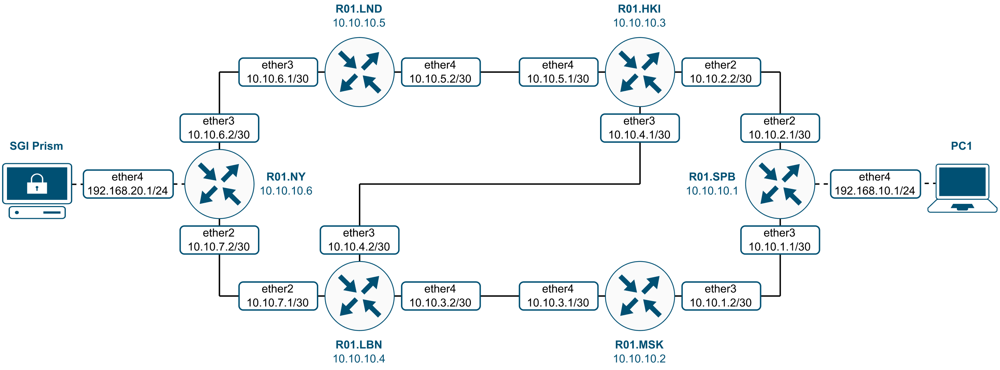
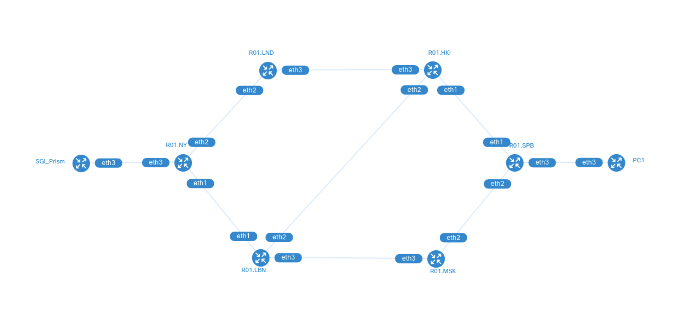
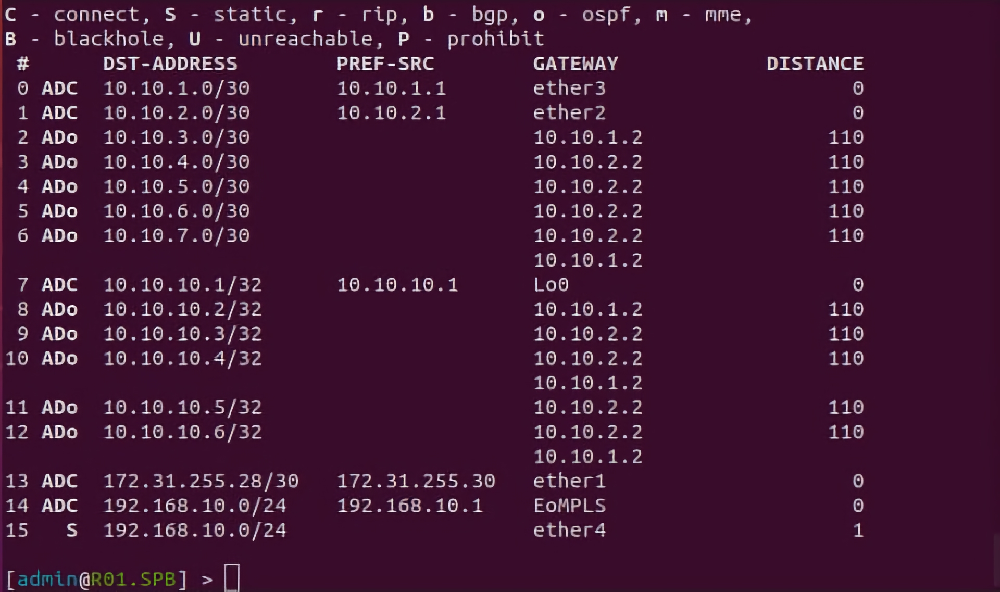
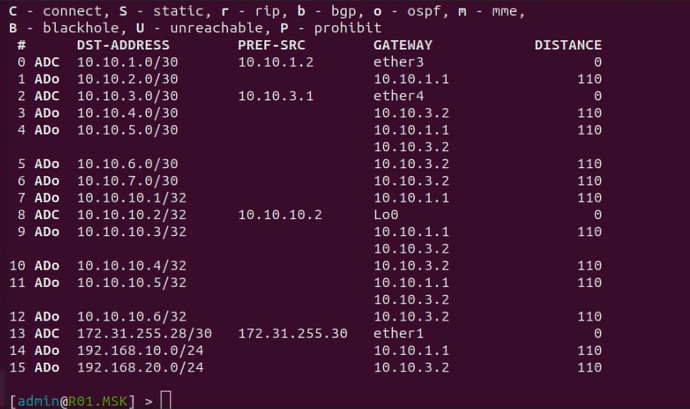

University: [ITMO University](https://itmo.ru/ru/)

Faculty: [FICT](https://fict.itmo.ru)

Course: [Introduction in routing](https://github.com/itmo-ict-faculty/introduction-in-routing)

Year: 2022/2023

Group: K33202

Author: Tanachev Egor Antonovich

Lab: Lab3

Date of create: 15.12.2022

Date of finished: 13.01.2023

# Отчёт по лабораторной работе №3 "Эмуляция распределенной корпоративной сети связи, настройка OSPF и MPLS, организация первого EoMPLS"

**Цель работы:** изучить протоколы OSPF и MPLS, механизмы организации EoMPLS.

### Ход работы

**1. Текст файла, который был использовался для развертывания тестовой сети с расширением .yaml:**

```
name: lab3


mgmt:
  network: statics
  ipv4_subnet: 172.20.20.0/24


topology:
  nodes:
    R01.SPB:
      kind: vr-ros
      image: vrnetlab/vr-routeros:6_47_9
      mgmt_ipv4: 172.20.20.2

    R01.MSK:
      kind: vr-ros
      image: vrnetlab/vr-routeros:6_47_9
      mgmt_ipv4: 172.20.20.3
    
    R01.HKI:
      kind: vr-ros
      image: vrnetlab/vr-routeros:6_47_9
      mgmt_ipv4: 172.20.20.4

    R01.LND:
      kind: vr-ros
      image: vrnetlab/vr-routeros:6_47_9
      mgmt_ipv4: 172.20.20.5

    R01.LBN:
      kind: vr-ros
      image: vrnetlab/vr-routeros:6_47_9
      mgmt_ipv4: 172.20.20.6

    R01.NY:
      kind: vr-ros
      image: vrnetlab/vr-routeros:6_47_9
      mgmt_ipv4: 172.20.20.7

    PC1:
      kind: vr-ros
      image: vrnetlab/vr-routeros:6_47_9
      mgmt_ipv4: 172.20.20.8

    SGI_Prism:
      kind: vr-ros
      image: vrnetlab/vr-routeros:6_47_9
      mgmt_ipv4: 172.20.20.9


links: 
  - endpoints: ["R01.SPB:eth2", "R01.MSK:eth2"]
  - endpoints: ["R01.SPB:eth1", "R01.HKI:eth1"]
  - endpoints: ["R01.MSK:eth3", "R01.LBN:eth3"]
  - endpoints: ["R01.HKI:eth3", "R01.LND:eth3"]
  - endpoints: ["R01.HKI:eth2", "R01.LBN:eth2"]
  - endpoints: ["R01.LND:eth2", "R01.NY:eth2"]
  - endpoints: ["R01.LBN:eth1", "R01.NY:eth1"]
  - endpoints: ["R01.SPB:eth3", "PC1:eth3"]
  - endpoints: ["R01.NY:eth3", "SGI_Prism:eth3"]
```

**2. Схема связи:**



**3. Топология ContainerLab:**



**4. Текст конфигураций сетевых устройств:**

**Роутер (R01.SPB)**

```
/interface bridge
add name=EoMPLS
add name=Lo0
/interface vpls
add cisco-style=yes cisco-style-id=666 disabled=no l2mtu=1500 mac-address=\
    02:BF:EE:4D:EF:F1 name=EoMPLS_VPLS remote-peer=10.10.10.6
/interface wireless security-profiles
set [ find default=yes ] supplicant-identity=MikroTik
/routing ospf instance
set [ find default=yes ] name=ospf0 router-id=10.10.10.1
/interface bridge port
add bridge=EoMPLS interface=ether4
add bridge=EoMPLS interface=EoMPLS_VPLS
/ip address
add address=172.31.255.30/30 interface=ether1 network=172.31.255.28
add address=10.10.1.1/30 interface=ether3 network=10.10.1.0
add address=10.10.2.1/30 interface=ether2 network=10.10.2.0
add address=192.168.10.1/24 interface=ether4 network=192.168.10.0
add address=10.10.10.1 interface=Lo0 network=10.10.10.1
/ip dhcp-client
add disabled=no interface=ether1
/ip route
add distance=1 dst-address=192.168.10.0/24 gateway=ether4
add distance=1 dst-address=192.168.20.0/24 gateway=10.10.10.6
/mpls ldp
set enabled=yes transport-address=10.10.10.1
/mpls ldp interface
add interface=ether2
add interface=ether3
/routing ospf network
add area=backbone
/system identity
set name=R01.SPB
```

**Роутер (R01.MSK)**

```
/interface bridge
add name=Lo0
/interface wireless security-profiles
set [ find default=yes ] supplicant-identity=MikroTik
/routing ospf instance
set [ find default=yes ] name=ospf0 router-id=10.10.10.2
/ip address
add address=172.31.255.30/30 interface=ether1 network=172.31.255.28
add address=10.10.1.2/30 interface=ether3 network=10.10.1.0
add address=10.10.3.1/30 interface=ether4 network=10.10.3.0
add address=10.10.10.2 interface=Lo0 network=10.10.10.2
/ip dhcp-client
add disabled=no interface=ether1
/mpls ldp
set enabled=yes transport-address=10.10.10.2
/mpls ldp interface
add interface=ether3
add interface=ether4
/routing ospf network
add area=backbone
/system identity
set name=R01.MSK
```

**Роутер (R01.HKI)**

```
/interface bridge
add name=Lo0
/interface wireless security-profiles
set [ find default=yes ] supplicant-identity=MikroTik
/routing ospf instance
set [ find default=yes ] name=ospf0 router-id=10.10.10.3
/ip address
add address=172.31.255.30/30 interface=ether1 network=172.31.255.28
add address=10.10.2.2/30 interface=ether2 network=10.10.2.0
add address=10.10.4.1/30 interface=ether3 network=10.10.4.0
add address=10.10.5.1/30 interface=ether4 network=10.10.5.0
add address=10.10.10.3 interface=Lo0 network=10.10.10.3
/ip dhcp-client
add disabled=no interface=ether1
/mpls ldp
set enabled=yes transport-address=10.10.10.3
/mpls ldp interface
add interface=ether2
add interface=ether3
add interface=ether4
/routing ospf network
add area=backbone
/system identity
set name=R01.HKI
```

**Роутер (R01.LND)**

```
/interface bridge
add name=Lo0
/interface wireless security-profiles
set [ find default=yes ] supplicant-identity=MikroTik
/routing ospf instance
set [ find default=yes ] name=ospf0 router-id=10.10.10.5
/ip address
add address=172.31.255.30/30 interface=ether1 network=172.31.255.28
add address=10.10.6.1/30 interface=ether3 network=10.10.6.0
add address=10.10.5.2/30 interface=ether4 network=10.10.5.0
add address=10.10.10.5 interface=Lo0 network=10.10.10.5
/ip dhcp-client
add disabled=no interface=ether1
/mpls ldp
set enabled=yes transport-address=10.10.10.5
/mpls ldp interface
add interface=ether3
add interface=ether4
/routing ospf network
add area=backbone
/system identity
set name=R01.LND
```

**Роутер (R01.LBN)**

```
/interface bridge
add name=Lo0
/interface wireless security-profiles
set [ find default=yes ] supplicant-identity=MikroTik
/routing ospf instance
set [ find default=yes ] name=ospf0 router-id=10.10.10.4
/ip address
add address=172.31.255.30/30 interface=ether1 network=172.31.255.28
add address=10.10.7.1/30 interface=ether2 network=10.10.7.0
add address=10.10.4.2/30 interface=ether3 network=10.10.4.0
add address=10.10.3.2/30 interface=ether4 network=10.10.3.0
add address=10.10.10.4 interface=Lo0 network=10.10.10.4
/ip dhcp-client
add disabled=no interface=ether1
/mpls ldp
set enabled=yes transport-address=10.10.10.4
/mpls ldp interface
add interface=ether2
add interface=ether3
add interface=ether4
/routing ospf network
add area=backbone
/system identity
set name=R01.LBN
```

**Роутер (R01.NY)**

```
/interface bridge
add name=EoMPLS
add name=Lo0
/interface vpls
add cisco-style=yes cisco-style-id=666 disabled=no l2mtu=1500 mac-address=\
    02:25:B9:5B:6B:A3 name=EoMPLS_VPLS remote-peer=10.10.10.1
/interface wireless security-profiles
set [ find default=yes ] supplicant-identity=MikroTik
/routing ospf instance
set [ find default=yes ] name=ospf0 router-id=10.10.10.6
/interface bridge port
add bridge=EoMPLS interface=ether4
add bridge=EoMPLS interface=EoMPLS_VPLS
/ip address
add address=172.31.255.30/30 interface=ether1 network=172.31.255.28
add address=10.10.7.2/30 interface=ether2 network=10.10.7.0
add address=10.10.6.2/30 interface=ether3 network=10.10.6.0
add address=192.168.20.1/24 interface=ether4 network=192.168.20.0
add address=10.10.10.6 interface=Lo0 network=10.10.10.6
/ip dhcp-client
add disabled=no interface=ether1
/ip route
add distance=1 dst-address=192.168.10.0/24 gateway=10.10.10.1
add distance=1 dst-address=192.168.20.0/24 gateway=ether4
/mpls ldp
set enabled=yes transport-address=10.10.10.6
/mpls ldp interface
add interface=ether2
add interface=ether3
/routing ospf network
add area=backbone
/system identity
set name=R01.NY
```

**PC1**

```
/interface wireless security-profiles
set [ find default=yes ] supplicant-identity=MikroTik
/ip address
add address=172.31.255.30/30 interface=ether1 network=172.31.255.28
add address=192.168.10.250/24 interface=ether4 network=192.168.10.0
/ip dhcp-client
add disabled=no interface=ether1
/ip route
add distance=1 gateway=192.168.10.1
/system identity
set name=PC1
```

**SGI_Prism**

```
/interface wireless security-profiles
set [ find default=yes ] supplicant-identity=MikroTik
/ip address
add address=172.31.255.30/30 interface=ether1 network=172.31.255.28
add address=192.168.20.250/24 interface=ether4 network=192.168.20.0
/ip dhcp-client
add disabled=no interface=ether1
/ip route
add distance=1 gateway=192.168.20.1
/system identity
set name=SGI_Prism
```

**5. Проверка локальной связности**

**Таблицы MPLS маршрутов на роутерах**



**Пинг компьютера и сервера**




### Вывод

В ходе работы были получены практические навыки по развертыванию сети связи и настройке OSPF, MPLS И EoMPLS.