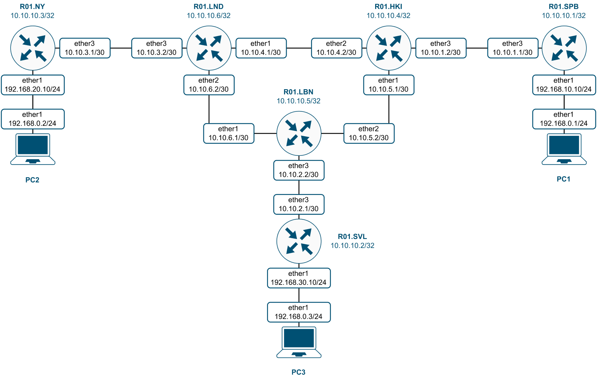
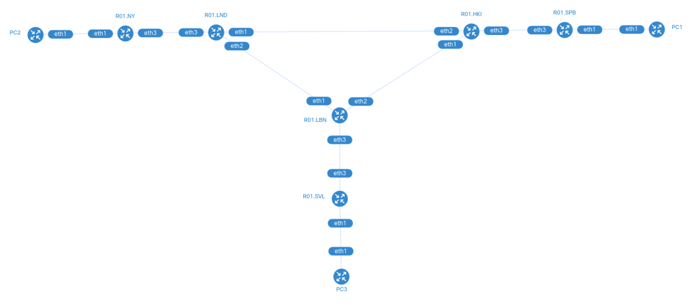
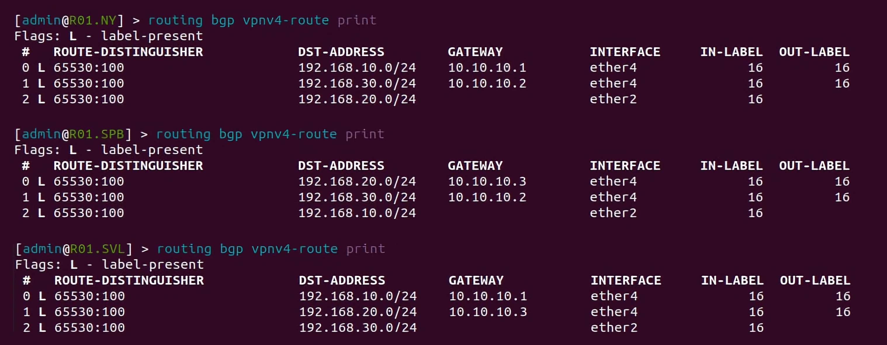
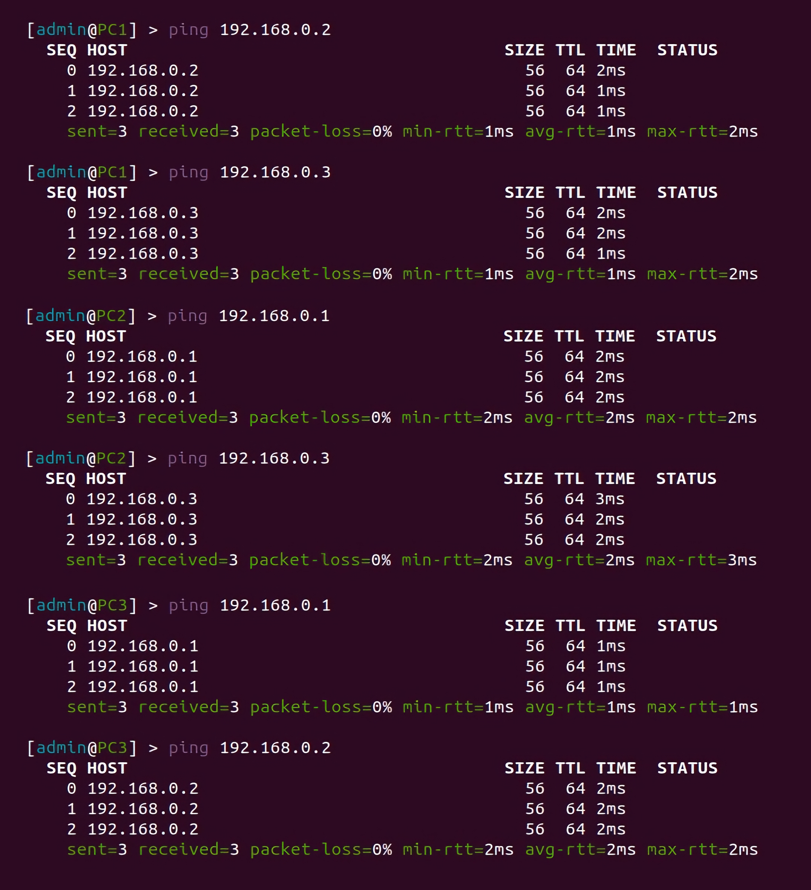

University: [ITMO University](https://itmo.ru/ru/)

Faculty: [FICT](https://fict.itmo.ru)

Course: [Introduction in routing](https://github.com/itmo-ict-faculty/introduction-in-routing)

Year: 2022/2023

Group: K33202

Author: Tanachev Egor Antonovich

Lab: Lab4

Date of create: 6.01.2023

Date of finished: 13.01.2023

# Отчет по лабораторной работе №4 "Эмуляция распределенной корпоративной сети связи, настройка iBGP, организация L3VPN, VPLS"

**Цель работы:** изучить протоколы BGP, MPLS и правила организации L3VPN и VPLS.

### Ход работы

**1. Текст файла, который был использовался для развертывания тестовой сети с расширением .yaml:**

```
name: lab4


mgmt:
  network: statics
  ipv4_subnet: 172.20.20.0/24


topology:
  nodes:
    R01.NY:
      kind: vr-ros
      image: vrnetlab/vr-routeros:6_47_9
      mgmt_ipv4: 172.20.20.2

    R01.LND:
      kind: vr-ros
      image: vrnetlab/vr-routeros:6_47_9
      mgmt_ipv4: 172.20.20.3

    R01.HKI:
      kind: vr-ros
      image: vrnetlab/vr-routeros:6_47_9
      mgmt_ipv4: 172.20.20.4

    R01.SPB:
      kind: vr-ros
      image: vrnetlab/vr-routeros:6_47_9
      mgmt_ipv4: 172.20.20.5

    R01.LBN:
      kind: vr-ros
      image: vrnetlab/vr-routeros:6_47_9
      mgmt_ipv4: 172.20.20.6

    R01.SVL:
      kind: vr-ros
      image: vrnetlab/vr-routeros:6_47_9
      mgmt_ipv4: 172.20.20.7

    PC1:
      kind: vr-ros
      image: vrnetlab/vr-routeros:6_47_9
      mgmt_ipv4: 172.20.20.8

    PC2:
      kind: vr-ros
      image: vrnetlab/vr-routeros:6_47_9
      mgmt_ipv4: 172.20.20.9

    PC3:
      kind: vr-ros
      image: vrnetlab/vr-routeros:6_47_9
      mgmt_ipv4: 172.20.20.10
  

links: 
  - endpoints: ["R01.NY:eth1","PC2:eth1"] 
  - endpoints: ["R01.NY:eth3","R01.LND:eth3"] 
  - endpoints: ["R01.LND:eth1","R01.HKI:eth2"]     
  - endpoints: ["R01.LND:eth2","R01.LBN:eth1"] 
  - endpoints: ["R01.LBN:eth2","R01.HKI:eth1"] 
  - endpoints: ["R01.LBN:eth3","R01.SVL:eth3"] 
  - endpoints: ["R01.SVL:eth1","PC3:eth1"]  
  - endpoints: ["R01.HKI:eth3","R01.SPB:eth3"]  
  - endpoints: ["R01.SPB:eth1","PC1:eth1"] 
```

**2. Схема связи:**



**3. Топология ContainerLab:**



**4. Текст конфигураций сетевых устройств:**

**Роутер (R01.NY)**

```
Текст
```

**Роутер (R01.LND)**

```
Текст
```

**Роутер (R01.HKI)**

```
Текст
```

**Роутер (R01.SPB)**

```
Текст
```

**Роутер (R01.LBN)**

```
Текст
```

**Роутер (R01.SVL)**

```
Текст
```

**5. Проверка локальной связности**

**Таблицы MPLS маршрутов на роутерах**





**Пинг компьютера и сервера**


### Вывод

В ходе работы были получены практические навыки работы с протоколами BGP, MPLS, а также были показаны правила организации L3VPN и VPLS.